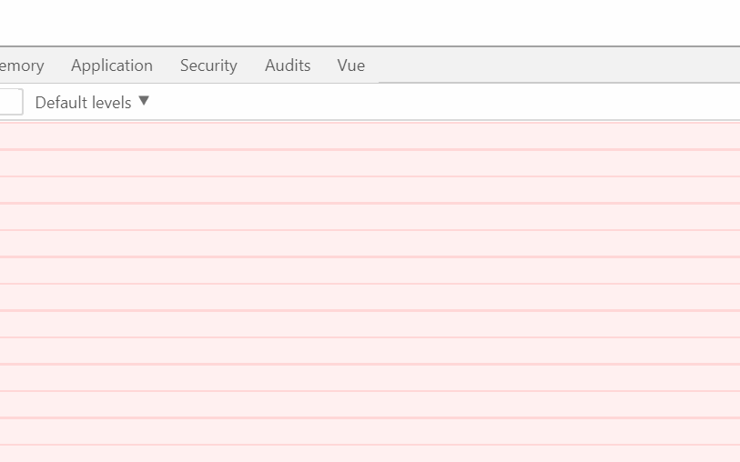

# 基于 webpack 打包动态加载图片 src 问题

> 直接上代码：

```js
<template>
  <ul class="la-photo-wall">
    <li class="la-photo-wall-item" v-for="(item,index) in imgData" :key="index">
      
    </li>
  </ul>
</template>
<script>
export default {
  computed: {
    imgData() {
      let datas = [];
      for (var i = 1; i < 21; i++) {
        datas.push({
          img: './img/' + i + '.jpg',//动态图片路径
        });
      }
      return datas;
    }
  }
};
</script>
```

> 结果：



结果发现图片不显示，错误码为 404。

报错的原因：在 webpack 中会将图片当做模块来用，比如：[{img:require('./src.jpg')}]因为是动态加载的，所以 url-loader 将无法解析图片地址。

常见的解决办法有两种：

1. 用 require 蒋图片作为模块加载，这时候 webpack 打包时，会将 require 打包成模块。
2. 将图片放到 static 目录下，但必须写成绝对路径，比如：[{img:'/static/src.jpg'}]。

好了，根据上述的解决方案，能不能行呢？下面对应的试一下！

1. 方法一：

> 源码

```js
<template>
  <ul class="la-photo-wall">
    <li class="la-photo-wall-item" v-for="(item,index) in imgData" :key="index">
      
    </li>
  </ul>
</template>
<script>
export default {
  computed: {
    imgData() {
      let datas = [];
      for (var i = 1; i < 21; i++) {
        datas.push({
          img: require('./img/' + i + '.jpg'),
        });
      }
      return datas;
    }
  }
};
</script>
```

> 结果：


2. 方法二：

> 源码

```js
<template>
  <ul class="la-photo-wall">
    <li class="la-photo-wall-item" v-for="(item,index) in imgData" :key="index">
      
    </li>
  </ul>
</template>
<script>
export default {
  computed: {
    imgData() {
      let datas = [];
      for (var i = 1; i < 21; i++) {
        datas.push({
          img: '/static/img/' + i + '.jpg',
        });
      }
      return datas;
    }
  }
};
</script>
```

<结果：


好了，经过试验，可以完美解决问题。
