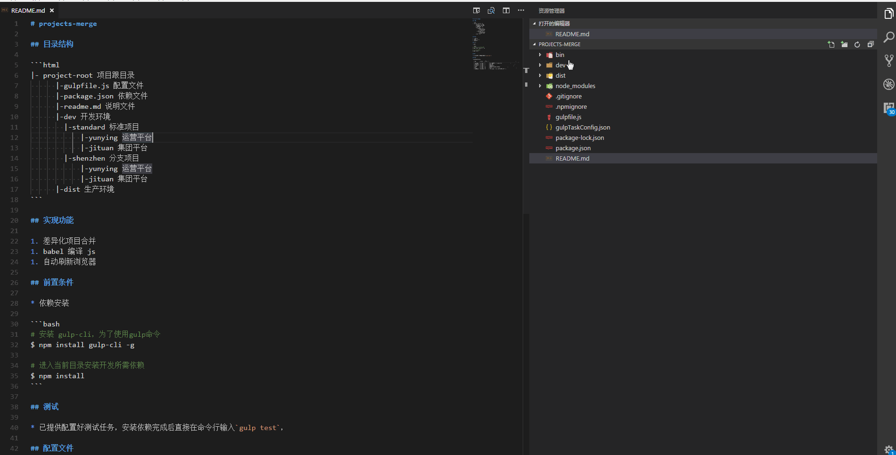

# 谈谈前端差异化项目打包

## 前言

以前实现差异化或者说项目上线之前会有一个项目的异化合并打包。这种事情以前一般都是运维或者是后端同事去干，用的一般是 ant 或者是自己写个脚本什么的，在这里我们就不说了【其实是没有玩过】。但是这样做的缺点也是很明显，缺点如下：

上线之前合并的项目前端人员没法看到或者说要发布到测试环境后才可以看到，对前端哥哥来说实在是不友好，当然了你要是说直接 copy 一份覆盖后用 live-server 启动不就可以了吗？可以是可以但是这样做太 low 不说，万一做的时候手一抖又出现好多 bug。所以作为一个有志青年，这种脏活累活还是不要自己去做，我们要工机器也就是工具去帮我们做。

所以就有这篇文章了！

## 差异化项目特点：

1. 90%以上的功能点都是一样。
2. 经常在一些城市级项目或者是跨国项目中出现。

## 前端打包差异化项目需求：

1. 差异化合并新老项目，减少项目重复开发带来的开发和维护成本。
2. 同时对一些资源简单处理，比如对 js 进行 babel 转译等。
3. 合并打包时，打开浏览器展示合并后的项目内容并实现热更新。

基于上面的需求我们来一步步实现功能。

## 准备技术栈：

1. gulp
2. gulp-babel 转译 es6 语法等
3. del 删除项目内容
4. browser-sync 同步浏览器

## 一些概念声明

这里咱们先定义一下概念，这样对接下来的思路说明能更加的清晰些。

1. 标准项目【standard】，指的就是总的项目，也可以称为总干线，所有的开发功能和模块都在这里。
2. 差异化项目【shenzhen】，指的是需要差异化标准项目的项目。这里需要注意的是，需要差异化处理的文件或者文件夹名称一定要和标准项目文件和文件夹一一对应。
3. 目标项目，目标项目指标准项目和差异化项目合并后生成的项目

## 思路

基于上面的【一些概念声明】，我们写出了下面的步骤：

1. 找到标准项目【standard】和差异化项目【shenzhen】所有的文件
2. 对比标准项目【standard】和差异化项目【shenzhen】
3. 如果差异化项目【shenzhen】中存在标准项目【standard】的文件或者文件夹，则差异化项目【shenzhen】文件或者文件夹覆盖标准项目【standard】文件或者文件夹内容。
4. 找到目标项目并先删除目标项目内容
5. 把合并生成后的标准项目和差异化项目打包到目标项目中。

## 项目目录结构

```html
  project-merge 平台名称
    |-bin
    |-dev 开发环境
    |  |-standard 标准项目
    |      |-yunying 具体项目【多加这一步是因为我们平台是项目定制的，每个平台都会有很多项目，比如小程序、公众号、APP、pc官网等等】
    |  |-shenzhen 差异化项目
    |      |-yunying 差异化具体项目
    |-dist 生产环境
    |  |-shenzhen 打包后的差异化项目
          |-yunying 差异化具体项目
    |-gulpfile.js gulp任务管理
    |-gulpTaskConfig.json 项目配置文件
```

根据上面的项目目录结构简单说明：

1. 开发环境中的项目和生产环境想目录必须保持项目，包含所有的文件差异化文件名。
2. 上面的目录只所以多了一层是由于我司业务场景这么设置会更加合理，当然了，这个是可以变的，只是改变的时候对应的开发和生产环境结构跟着改变即可。

下面是具体说说 gulpTaskConfig.json 项目配置文件配置。

## gulpTaskConfig.json 配置项说明

| key       | value   | 是否必填 | 说明                                                        |
| --------- | ------- | -------- | ----------------------------------------------------------- |
| taskname  | string  | 是       | 任务名，用于在命令行输入，例如： gulp test                  |
| standard  | string  | 是       | 指定标准版位置                                              |
| different | string  | 是       | 指定差异化版本路径                                          |
| target    | string  | 是       | 指定打包生产目录路径                                        |
| port      | string  | 否       | 指定端口位置，用于同时启动多个任务时需要配置                |
| note      | string  | 否       | 任务说明                                                    |
| needBabel | boolean | 否       | 是否需要 babel 编译，默认不开启，老项目某些代码不能通过编译 |

## gulpfile.js 配置项说明

```js
var gulp = require('gulp');
var del = require('del');
var path = require('path');
var browserSync = require('browser-sync');
var reload = browserSync.reload;
var babel = require('gulp-babel');
//拿到对应的配置项
var gulpTaskConfig = require('./gulpTaskConfig.json');

gulpTaskConfig.forEach(item => {
  const DEL = `${item.taskname}_del`;
  const BUILD = `${item.taskname}_build_without_js`;
  const BUILDJS = `${item.taskname}_build_with_js`;
  const SERVER = `${item.taskname}_server`;
  //每次打包时，先删除目标项目内容
  gulp.task(DEL, function() {
    del([`${item.target}/**/*`]);
  });
  /**合并除js以外文件 */
  gulp.task(BUILD, function() {
    gulp.src([`${item.standard}/**/!(*.js)`, `${item.different}/**/!(*.js)`]).pipe(gulp.dest(item.target));
  });
  /**babel 编译js */
  gulp.task(BUILDJS, function() {
    const paths = gulp.src([`${item.standard}/**/*.js`, `${item.different}/**/*.js`]);
    if (item.needBabel) {
      paths
        .pipe(
          babel({
            presets: ['@babel/env'],
          }),
        )
        .pipe(gulp.dest(item.target));
    } else {
      paths.pipe(gulp.dest(item.target));
    }
  });

  /**起server */
  gulp.task(SERVER, function() {
    browserSync({
      server: {
        baseDir: `${item.target}`,
        reloadDebounce: 1000,
      },
      port: item.port || 8080,
    });
  });
  //执行任务
  gulp.task(item.taskname, function() {
    gulp.run(DEL, BUILD, BUILDJS, SERVER);
    gulp.watch(`${item.different}/**`, [BUILD, BUILDJS]).on('change', reload);
  });
});
```

## 使用步骤

1. 安装 gulp-cli，为了使用 gulp 命令
   $ npm install gulp-cli -g

2. 进入当前目录安装开发所需依赖
   $ npm install

3. gulp test【对应 gulpTaskConfig.json 中的 taskname】执行

## 结果



具体项目源码，可以到我的 github 查看[传送门](https://github.com/wqb2017/projects-merge)
